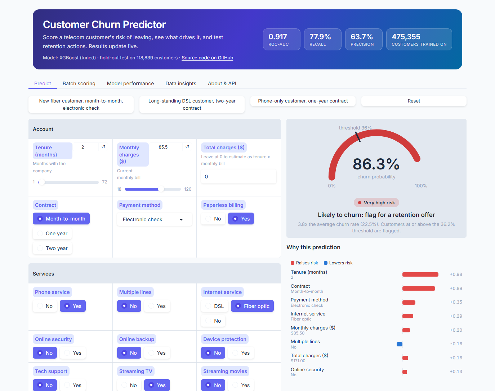
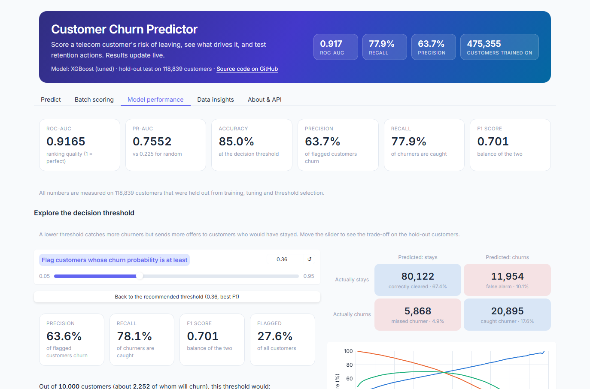
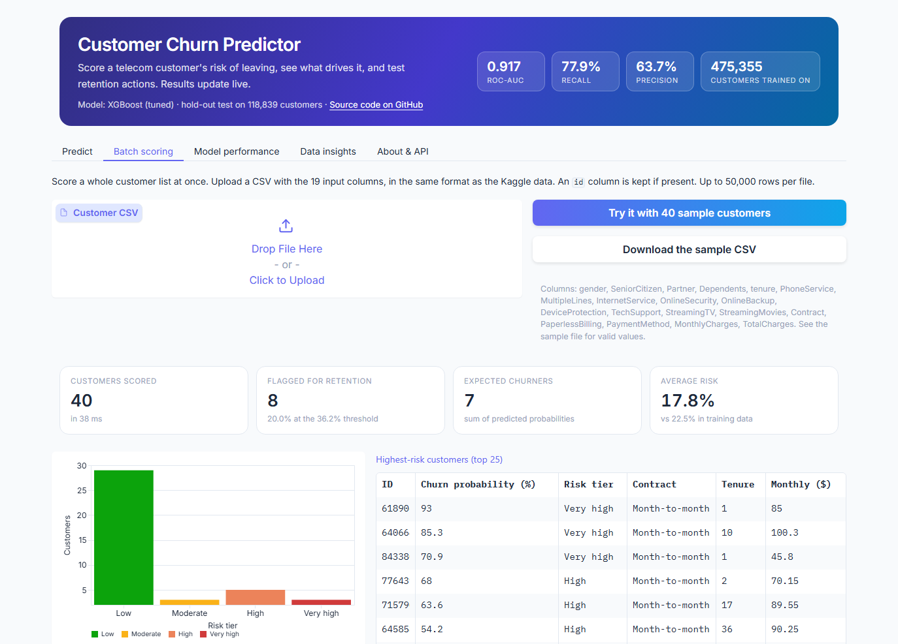
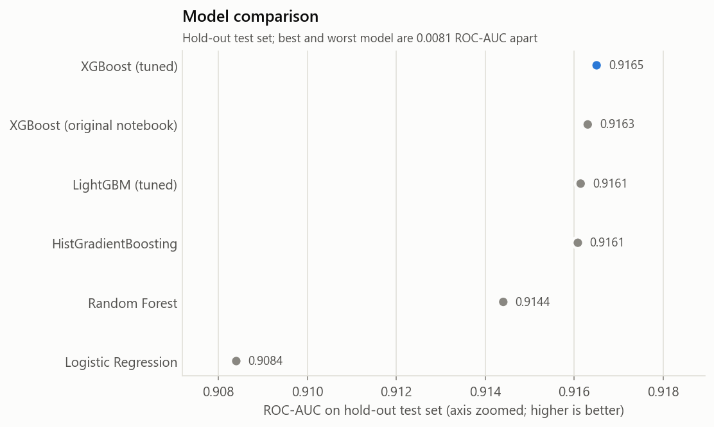
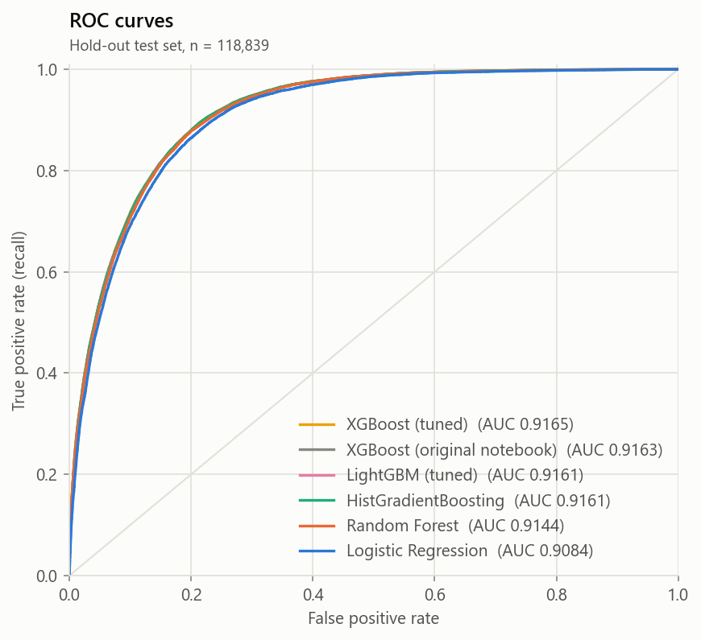
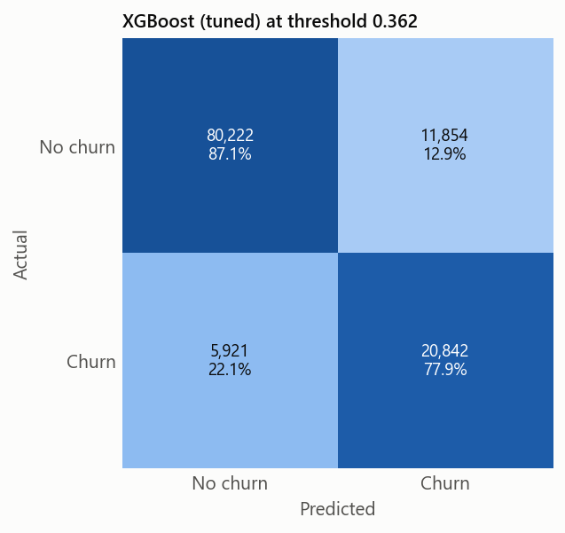
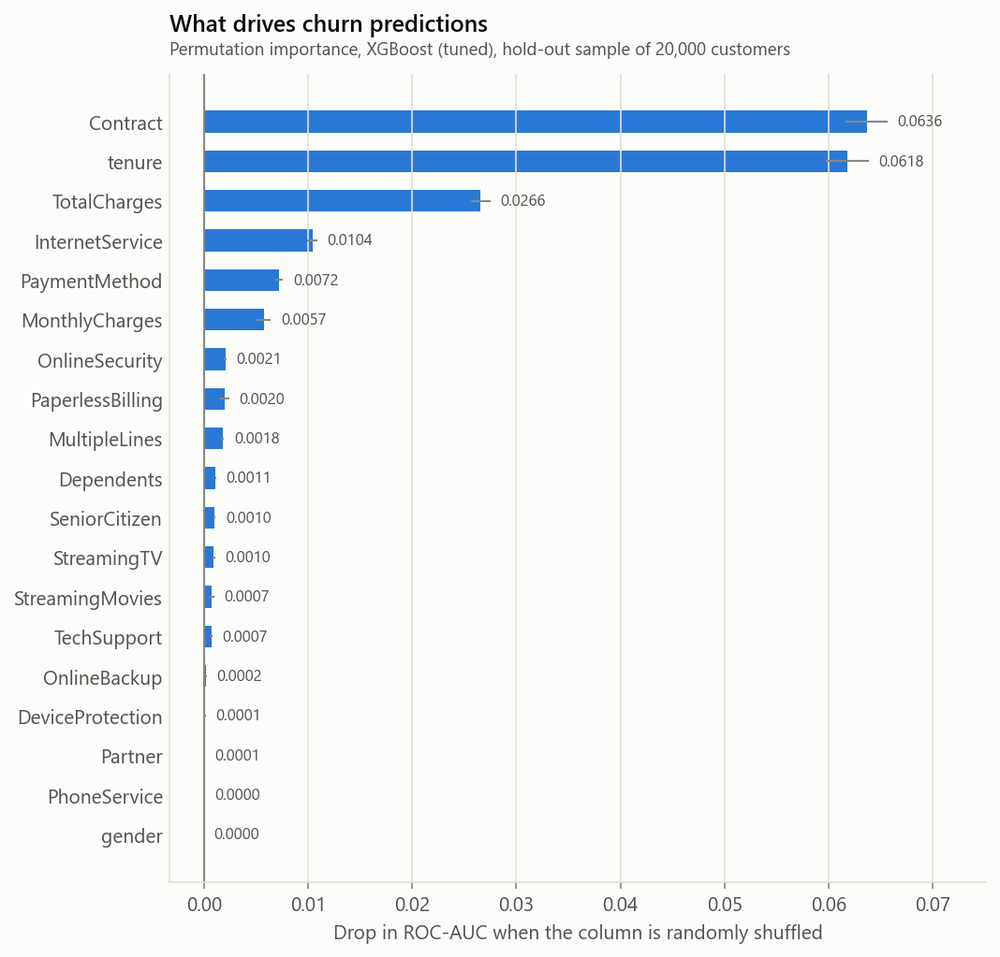
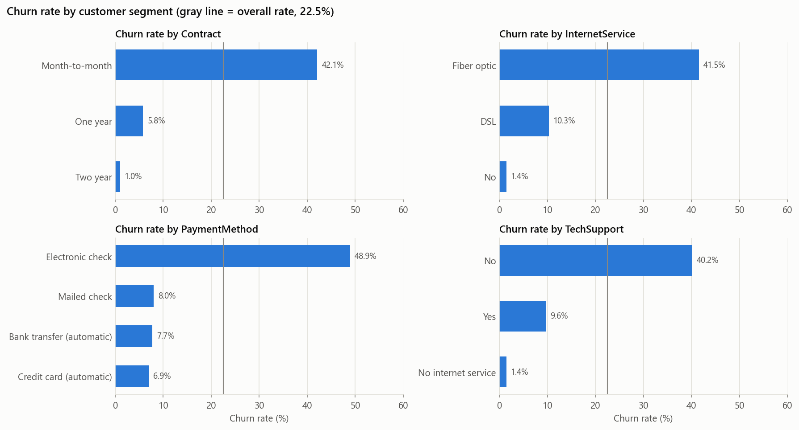
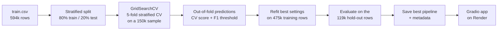

# Customer Churn Prediction


[](https://churn-predictor-aviraj.onrender.com)

Predicts the probability that a telecom customer will cancel their service, so a retention team knows who to
contact first. Built on the 594,000-customer Kaggle Playground S6E3 dataset as a production-style ML project:
one scikit-learn pipeline from raw data to prediction, five tuned and compared models, an honest hold-out
evaluation, automated tests, and a live web demo.

**[Try the live demo](https://churn-predictor-aviraj.onrender.com)**

<p align="center">
  
</p>

The web app has five tabs:

- **Predict:** results update live as you change any input. An animated risk gauge and risk tier, **why** the
  model decided (per-customer SHAP contributions), **what would reduce the risk** (the model re-scores the
  customer after each retention action, e.g. a two-year contract takes a new fiber customer from 86% to 31%),
  and how risk changes with tenure.
- **Batch scoring:** upload a CSV of customers and get summary cards, a risk-tier chart, the highest-risk
  customers and a downloadable scored file (validated input, up to 50,000 rows, about 1 second).
- **Model performance:** a threshold slider that shows, live, how precision, recall, the confusion matrix and
  "per 10,000 customers" campaign numbers change, plus the model comparison, ROC / PR curves and feature importance.
- **Data insights:** churn rate for any customer segment and by tenure, with key findings.
- **About & API:** how the system works, a model card (intended use, limitations, fairness check) and a JSON API.

<p align="center">
  
  
</p>

---

## Problem

Keeping a customer is much cheaper than winning a new one. Given a customer's account details, services and
billing, predict how likely they are to churn (binary classification). The competition metric is **ROC-AUC**:
how well the model ranks churners above customers who stay.

## Dataset

[Kaggle Playground Series, Season 6 Episode 3](https://www.kaggle.com/competitions/playground-series-s6e3)
(CC BY 4.0), a synthetic dataset generated from the IBM Telco churn data.

| | |
|---|---|
| Training rows | 594,194. Kaggle's `test.csv` has no labels, so a hold-out split of `train.csv` is used for evaluation |
| Features | 19: 4 numeric (tenure, monthly and total charges, senior citizen) and 15 categorical (contract, services, payment, demographics) |
| Target | `Churn`: Yes (22.5%) / No (77.5%) |
| Data quality | No missing values, no duplicate rows |

See [`data/README.md`](data/README.md) for the full schema and download steps.

## Results

All models were evaluated on the same **stratified hold-out test set of 118,839 customers** that was never
used for training, tuning or choosing the decision threshold.

| Model | CV ROC-AUC | Test ROC-AUC | Test PR-AUC | Accuracy | Precision | Recall | F1 |
|---|---|---|---|---|---|---|---|
| **XGBoost (tuned)** | 0.9141 ± 0.0012 | **0.9165** | 0.7552 | 0.850 | 0.637 | 0.779 | 0.701 |
| XGBoost (original notebook settings) | 0.9136 ± 0.0012 | 0.9163 | 0.7546 | 0.850 | 0.636 | 0.780 | 0.701 |
| LightGBM (tuned) | 0.9136 ± 0.0013 | 0.9161 | 0.7544 | 0.846 | 0.622 | 0.803 | 0.701 |
| HistGradientBoosting | 0.9135 ± 0.0013 | 0.9161 | 0.7536 | 0.849 | 0.632 | 0.786 | 0.700 |
| Random Forest | 0.9122 ± 0.0012 | 0.9144 | 0.7493 | 0.847 | 0.627 | 0.788 | 0.698 |
| Logistic Regression | 0.9072 ± 0.0015 | 0.9084 | 0.7270 | 0.837 | 0.603 | 0.805 | 0.690 |

Precision, recall and F1 are measured at each model's own decision threshold, chosen to maximise F1 on
training data (0.362 for the final model). Full table and best hyperparameters:
[`reports/model_comparison.md`](reports/model_comparison.md).

**What the results say**

- **The final model catches 78% of churners**, and 64% of the customers it flags really do churn. Picking
  customers at random would give 22.5%.
- **All boosting models are within 0.0005 ROC-AUC of each other.** Tuning improved the original notebook's
  XGBoost by 0.0002, less than the cross-validation standard deviation (0.0012). The original settings were
  already close to the ceiling for this data, so the choice of boosting library matters little here.
- **Logistic Regression is only 0.008 behind the best model.** A simple, fully interpretable model is a
  realistic alternative when explainability matters more than the last bit of accuracy.
- **Class weighting did not improve ROC-AUC for any model** (see [`reports/tuning/`](reports/tuning)). ROC-AUC
  only depends on how customers are ranked, which re-weighting barely changes. The imbalance is handled where it
  matters instead: a decision threshold of 0.362 rather than 0.5, which trades some precision for higher recall.

<p align="center">
  
  
</p>
<p align="center">
  
  
</p>

More figures: [precision-recall curves](reports/figures/precision_recall_curves.png),
[confusion matrices for every model](reports/figures/confusion_matrices.png), and the EDA figures in
[`reports/figures/`](reports/figures).

## Key insights from the data

From [`notebooks/02_eda.ipynb`](notebooks/02_eda.ipynb):

- **Contract type is the strongest signal.** Month-to-month customers churn at 42%, about 42x the rate of
  two-year customers (1%). It is also the model's most important feature.
- **Electronic check payers churn at 49%**, about 6.5x the rate of customers on any other payment method.
- **No tech support (40%) and fiber optic internet (41.5%)** are the other high-risk segments.
- **Risk is concentrated in the first year.** 49% of first-year customers churn vs 5% of customers with more
  than four years of tenure. Churners have been customers for 17 months on average, vs 42 months for
  customers who stay.
- **Churners pay about $20 more per month** on average ($81.60 vs $61.29).
- **Senior citizens churn at 50%** vs 19% for other customers, a segment the original notebook did not look at.
  The model barely relies on this column, because seniors are far more often on month-to-month contracts (78% vs
  47%), fiber (86% vs 41%) and electronic check (70% vs 32%), so those columns already carry the signal.

<p align="center">
  
</p>

## Approach



1. **One pipeline for training and inference.** Preprocessing and the model are a single scikit-learn
   `Pipeline`, saved as one file:
   - numeric columns: median imputation, then standard scaling
   - categorical columns: most-frequent imputation, then one-hot encoding (`handle_unknown="ignore"`)
   - three engineered features: average charge per month, recent price increase, number of add-on services
2. **Five models**: the original XGBoost and LightGBM, plus Logistic Regression, Random Forest and
   scikit-learn's HistGradientBoosting.
3. **Tuning** with `GridSearchCV` and stratified 5-fold cross-validation, optimising ROC-AUC. Each grid includes
   the original notebook's settings, and class weighting is searched as a hyperparameter.
4. **Model selection** by cross-validated ROC-AUC. The hold-out test set is only used for the final report.
5. **Decision threshold** chosen to maximise F1 on out-of-fold training predictions.
6. **Evaluation**: ROC-AUC, PR-AUC, accuracy, precision, recall, F1, confusion matrices, ROC and PR curves,
   and permutation feature importance.

**The refactor preserves the original result.** Run through the new pipeline on the same 5 folds, the original
notebook's XGBoost settings score 0.91582 mean CV AUC vs 0.91574 in the notebook
([`reports/experiments.md`](reports/experiments.md)).

## Deployment

The demo is a [Gradio](https://www.gradio.app/) app ([`app/app.py`](app/app.py)) running on
[Render](https://render.com)'s free tier, configured in [`render.yaml`](render.yaml). Every push to `main`
redeploys it. The app loads the committed pipeline (`models/best_model.joblib`), so it applies exactly the same
preprocessing as training. [`app/requirements.txt`](app/requirements.txt) pins the library versions the model
was trained with, and a test fails if they drift apart. An uptime monitor pings the app every 5 minutes, so
the free instance does not go to sleep.

Engineering details:

- **Explanations without extra libraries:** XGBoost's built-in exact SHAP values (`pred_contribs`), summed from
  one-hot columns back to the original fields. A test checks that they add up to the predicted probability.
- **No raw data on the server:** training writes small report tables (threshold analysis, curve points, segment
  churn rates, about 60 KB in total) that power the performance and insights tabs.
- **JSON API** at `/predict` (probability, decision, risk tier, top drivers), with Python and cURL examples on
  the About tab. UI events are hidden from the API.
- **Tested and measured:** the event handlers, HTML components, batch validation and API have unit tests.
  About 9 ms per prediction, a median of 133 ms per API round trip, about 355 MB of memory (free instance: 512 MB).
- **Works on phones and in dark mode:** responsive layout, and colors defined as CSS variables.

```python
from gradio_client import Client
client = Client("https://churn-predictor-aviraj.onrender.com/")
result = client.predict(customer={...19 input fields...}, api_name="/predict")
```

## Project structure

```
├── app/
│   ├── app.py                  Gradio app: layout, event handlers, JSON API
│   ├── components.py           HTML building blocks (gauge, driver bars, cards, confusion matrix)
│   ├── artifacts.py            loads the model and report tables once at startup
│   ├── theme.py                theme and CSS (light/dark, responsive)
│   ├── assets/                 sample CSV for batch scoring
│   └── requirements.txt        pinned inference dependencies for deployment
├── config.yaml                 paths, seed, split, CV and hyperparameter grids
├── data/                       raw Kaggle CSVs (not committed; see data/README.md)
├── models/                     best_model.joblib + metadata.json (threshold, metrics, versions)
├── notebooks/
│   ├── 01_original_colab_notebook.ipynb   the original analysis, unchanged
│   └── 02_eda.ipynb                       cleaned exploratory analysis
├── render.yaml                 Render deployment config
├── reports/                    model comparison, tuning results, experiments log, app tables
│   └── figures/                all plots
├── scripts/feature_ablation.py parity check vs the notebook + engineered-feature ablation
├── src/
│   ├── config.py               loads config.yaml
│   ├── data.py                 loading, target encoding, stratified split
│   ├── features.py             feature schema + engineered features
│   ├── preprocessing.py        ColumnTransformer pipeline
│   ├── models.py               model registry
│   ├── train.py                tuning, evaluation, model selection   (python -m src.train)
│   ├── evaluate.py             metrics, threshold, report figures
│   ├── predict.py              single-customer and batch prediction  (python -m src.predict)
│   ├── explain.py              SHAP drivers, retention what-ifs, tenure outlook
│   └── plot_style.py           shared chart style
├── submissions/                Kaggle submission files
└── tests/                      pytest suite (runs on synthetic data, no download needed)
```

## How to run

```bash
git clone https://github.com/aviraj1805/Customer-Churn-Prediction.git
cd Customer-Churn-Prediction
python -m venv .venv
source .venv/bin/activate          # Windows: .venv\Scripts\activate
pip install -r requirements.txt
```

The trained model is committed, so the demo and tests work straight after cloning:

```bash
python app/app.py                  # demo at http://127.0.0.1:7860
pytest                             # test suite
```

To retrain, download the data into `data/raw/` ([instructions](data/README.md)), then:

```bash
python -m src.train --quick        # ~3 min smoke run, writes to .quick_run/
python -m src.train                # full run, ~15-20 min on 12 CPU cores
python -m src.predict              # Kaggle submission -> submissions/submission.csv
python -m src.predict --input customers.csv --output scored.csv
python -m scripts.feature_ablation # reproduce the original notebook's baseline
```

All settings (seed, split, CV folds, grids) are in [`config.yaml`](config.yaml). Seeds are fixed: rerunning the
full training reproduces every metric exactly.

## Tech stack

Python 3.10 · pandas · NumPy · scikit-learn · XGBoost · LightGBM · Matplotlib · Seaborn · pytest ·
Gradio · Render

## Author

**Aviraj Virape**
- GitHub: [@aviraj1805](https://github.com/aviraj1805)
- Kaggle: [@avirajvirape](https://www.kaggle.com/avirajvirape)
- LinkedIn: [Aviraj Virape](https://www.linkedin.com/in/aviraj-virape-667a31217/)

## License

Built for educational purposes. Dataset from
[Kaggle Playground Series S6E3](https://www.kaggle.com/competitions/playground-series-s6e3) under CC BY 4.0.
